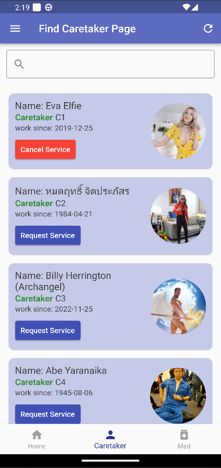
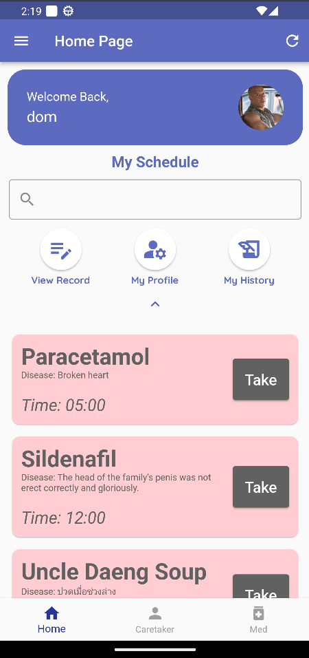
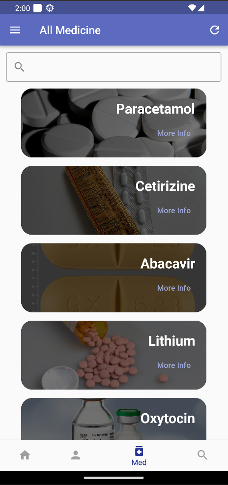
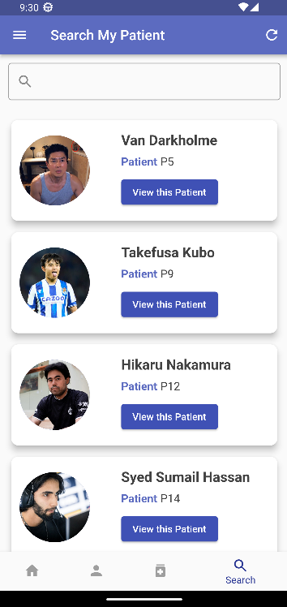

# Overview:
*Overdose-Software* is the culminating project for the CPE327 Software Engineering course. It's a comprehensive solution catering to the healthcare sector, specifically targeting patient care and medication management. The project encompasses a mobile application and a responsive web demo, providing users with seamless access and interaction.

# Mobile Application Features:
The mobile application serves as the primary interface for both patients and caretakers. Here's a detailed look at its features:
1. **Role-based Access:** The system distinguishes between patients and caretakers, ensuring tailored functionalities for each user type.
2. **Patient Functionality:**
    * **Caretaker Selection:** Patients can browse and select caretakers from a list to oversee their care.
    * **Drug Information Access:** Patients can access a comprehensive database containing detailed information about various medications.
3. **Caretaker Functionality:**
    * **Prescription Management:** Caretakers can generate and manage prescriptions for the patients under their care, streamlining the medication administration process.
 
 &ensp;&ensp;&ensp;

# Web demo:
<h3 align="left">Responsive web demo: <a href="https://weatherreporto.pythonanywhere.com/">Home page</a> (from this GitHub <a href="https://github.com/Miran-Mirantee/Overdose-webpage">repo</a>, thanks to <a href="https://github.com/Miran-Mirantee/">Kantawat S.</a>)</h3>
<h3 align="left">About us: <a href="https://weatherreporto.pythonanywhere.com/about/">About page</a></h3>
<h3 align="left">Contact us: <a href="https://weatherreporto.pythonanywhere.com/contact/">Contact page</a></h3>
<h3 align="left">Install APK: <a href="https://drive.google.com/drive/folders/11B1iHNkQi0HDjUran_029edsGej3-9QN">Download link</a></h3>

<h3 align="left">Scope & Details:</h3>

 * The application has two assigned roles: Patient & Caretaker.
 * Patients can access the app to select a Caretaker to take care of them.
 * Patients can access and view drug information in our company's database.
 * Caretakers will be able to write prescriptions for patients in their care.

<h3 align="left">Languages and Tools:</h3>

 
 
 

 

# Conclusion:
*Overdose-Software* exemplifies a comprehensive approach to software engineering, addressing critical needs within the healthcare domain through the integration of mobile and web technologies. By providing tailored solutions for patients and caretakers, coupled with a user-friendly interface and robust backend infrastructure, the project aims to enhance the quality of patient care and medication management.
